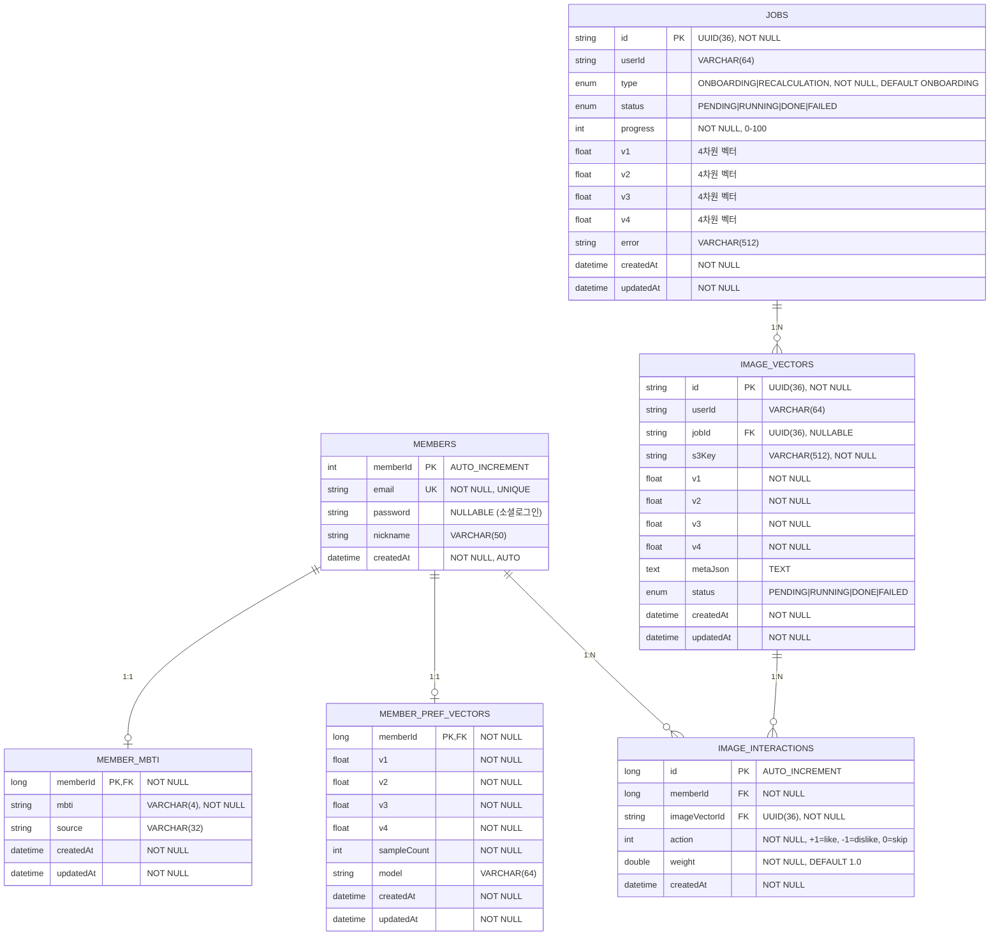

# Nerget Backend ERD (Entity Relationship Diagram)

## Mermaid ERD

## 테이블 설명

### 1. MEMBERS (회원)

- **주요 기능**: 사용자 기본 정보 관리
- **특징**: 소셜 로그인 지원 (password nullable)
- **인덱스**: email (UNIQUE)

### 2. MEMBER_MBTI (회원 MBTI)

- **주요 기능**: 사용자의 MBTI 결과 저장
- **관계**: MEMBERS와 1:1 관계
- **특징**: source 필드로 MBTI 산출 근거 관리

### 3. MEMBER_PREF_VECTORS (회원 선호도 벡터)

- **주요 기능**: 사용자의 누적된 선호도 벡터 저장
- **관계**: MEMBERS와 1:1 관계
- **특징**: 4차원 벡터로 선호도 표현, sampleCount로 학습 데이터 수 추적

### 4. JOBS (작업)

- **주요 기능**: AI 처리 작업 상태 관리
- **특징**: UUID 기반 ID, 4차원 벡터 결과 저장, 타입별 관리
- **상태**: PENDING → RUNNING → DONE/FAILED
- **타입**: ONBOARDING (최초 로그인), RECALCULATION (재계산)
- **제약**: 사용자당 ONBOARDING Job 1개만 허용

### 5. IMAGE_VECTORS (이미지 벡터)

- **주요 기능**: 이미지의 AI 분석 결과(벡터) 저장
- **특징**: S3 키와 4차원 벡터, 메타데이터 JSON 저장
- **인덱스**: userId, status, createdAt

### 6. IMAGE_INTERACTIONS (이미지 상호작용)

- **주요 기능**: 사용자의 이미지에 대한 반응 기록
- **관계**: MEMBERS와 IMAGE_VECTORS를 연결하는 중간 테이블
- **특징**: like/dislike/skip 액션, 가중치 지원
- **제약조건**: (memberId, imageVectorId) UNIQUE

## 주요 특징

1. **벡터 기반 추천 시스템**: 4차원 벡터를 사용한 AI 기반 추천
2. **상태 관리**: Job과 ImageVector에서 처리 상태 추적
3. **유연한 관계**: FK를 통한 느슨한 결합으로 확장성 확보
4. **인덱스 최적화**: 자주 조회되는 컬럼에 인덱스 설정
5. **메타데이터 지원**: JSON 형태의 확장 가능한 메타데이터 저장
